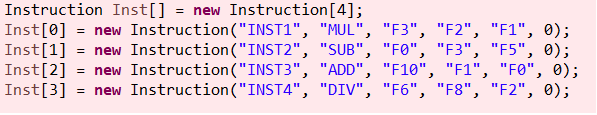
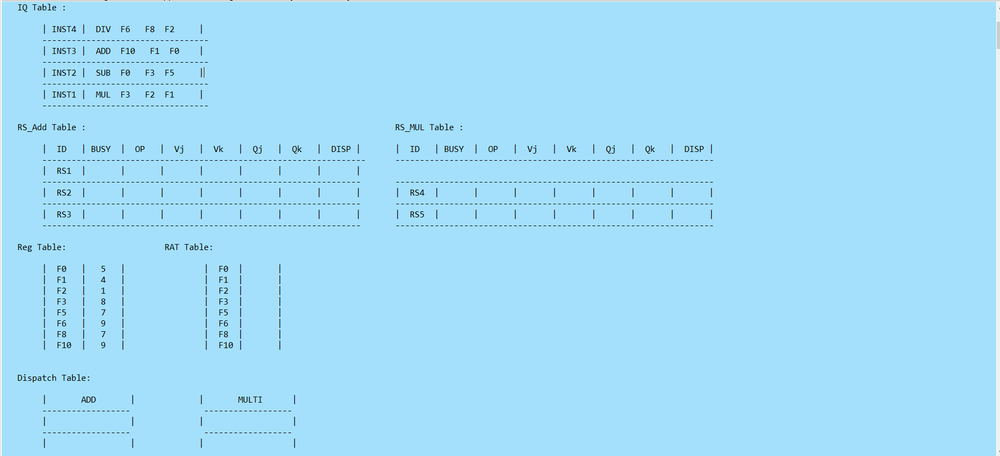

# tomasulo-s-algorithm
## 1.本程式為實作tomasulo-s-algorithm演算法
* 使用語言 Java(JRE JavaSE-12)
* 開發及編譯工具 Eclipse
* 輸入方式 
    1.允許使用者自行輸入ADD(加)、SUB(減)、MUL(乘)、DIV(除)運作之cycle數
    2.目前支援ADD、SUB、MUL、DIV等四項基礎運算，其他運算後續補充之
    3.允許使用者由原始碼端自行編輯Instruction數量及上述四項運算之運作
    4.完成上述初始狀態輸入後，由Eclipse IDE介面(或任何可執行Java語言之IDE)按下執行鍵，軟體即自行運作至所有Instruction取得暫存器之值後，自動停止
 ## 2.執行結果如下
    1.允許使用者自行輸入ADD(加)、SUB(減)、MUL(乘)、DIV(除)運作之cycle數

    2.使用者可由原始碼頁面輸入Instruction指令

    3.初始狀態預覽

