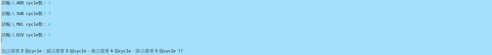

# Tomasulo-s-algorithm
## 1.本程式為實作Tomasulo-s-algorithm演算法
* 使用語言 Java(JRE JavaSE-12)
* 開發及編譯工具 Eclipse
* 輸入方式 
    1.允許使用者自行輸入ADD(加)、SUB(減)、MUL(乘)、DIV(除)運作之cycle數
    2.目前支援ADD、SUB、MUL、DIV等四項基礎運算，其他運算後續補充之
    3.允許使用者由原始碼端自行編輯Instruction數量及上述四項運算之運作
    4.完成上述初始狀態輸入後，由Eclipse IDE介面(或任何可執行Java語言之IDE)按下執行鍵，軟體即自行運作至所有Instruction取得暫存器之值後，自動停
 	止	
    5.本次執行案例系將ADD設為2cycle、SUB設為3cycle、MUL設為4cycle、DIV設為5cycle
    6.本軟體共模擬IQ Table儲存指令、RS_ADD_Table設置三個空間大小、RS_MUL設置二個空間大小、Reg Table儲存暫存器實際數值(系統預設值自動採1~10亂	數產生相關資料)、RAT Table、加減法、乘除法 Buffer暫存器各一個，將在下節實際執行結果畫面呈現。
 
 ## 2.執行結果如下(以紅色方框標註各cycle變化)
    1.允許使用者自行輸入ADD(加)、SUB(減)、MUL(乘)、DIV(除)運作之cycle數

    2.使用者可由原始碼頁面輸入Instruction指令

    3.初始狀態預覽

    4.第1個cycle

    5.第2個cycle

    6.第3個cycle

    7.第4個cycle

    8.第5個cycle

    9.第6個cycle

    10.第7個cycle

    11.第8個cycle

    12.第9個cycle

    13.第10個cycle

    14.第11個cycle

   15.第12個cycle

   16.第13個cycle，以本範例，系統自動偵測無其他任何指令等待運算，自動結束運算

## 3.程式說明
 * 程式5~104行:為本次運算使用之類別，含:
     1. Instruction:設定指令數量及指令內容
     2. RSAdd:設定加、減運算之RS Table欄位，預設三個空間
     3. RSMul:設定乘、除運算之RS Table欄位，預設兩個空間
     4. RS_ld:設定讀取、寫入運算之RS Table欄位，本次尚未使用
     5. RAT:設定RAT Table欄位資料
     6. Dispatch:設定如Dispatch時，Buffer資料內容同步
     7. REGS:設定REG Table欄位資料  
<pre><code>
class Instruction {
	String name, op, fsu, fj, fk;
	int count;

	Instruction() {
		this.name = "";
		this.op = "";
		this.fsu = "";
		this.fj = "";
		this.fk = "";
		this.count = 0;
	}

	Instruction(String na, String o, String fs, String j, String k, int co) {
		name = na;
		op = o;
		fsu = fs;
		fj = j;
		fk = k;
		count = co;
	}
}

class RSAdd {
	String ID, BUSY, OP, Qj, Qk, DISP, inst, Vj, Vk;
	int candidate;

	RSAdd() {
		this.ID = " ";
		this.BUSY = " ";
		this.OP = " ";
		this.Vj = " ";
		this.Vk = " ";
		this.Qj = " ";
		this.Qk = " ";
		this.DISP = " ";
		this.inst = " ";
		this.candidate = -1;
	}
}

class RSMul {
	String ID, BUSY, OP, Qj, Qk, DISP, inst, Vj, Vk;

	RSMul() {
		this.ID = " ";
		this.BUSY = " ";
		this.OP = " ";
		this.Vj = " ";
		this.Vk = " ";
		this.Qj = " ";
		this.Qk = " ";
		this.DISP = " ";
		this.inst = " ";
	}
}

class RS_ld {
	Boolean busy, disp;
	String OP, Qj;
	int Vk;

	RS_ld() {
		this.busy = false;
		this.disp = false;
		this.OP = null;
		this.Qj = null;
	}
}

class RAT {
	String rat, content;

	RAT() {
		this.rat = null;
		this.content = null;

	}
}

class Dispatch {
	String ID, Inst, buffer, state;

	Dispatch() {
		this.ID = " ";
		this.Inst = " ";
		this.buffer = " ";
		this.state = " ";
	}
}

class REGS {
	String reg;
	int content;

	REGS() {
		this.reg = null;

	}
}</code></pre>

 * 程式106-292行:為主程式，說明如下
     1. 106-126行:由使用者輸入+、-、x、/指令運算所需cycle數
 <pre><code>
  public class tomasulo_algorithm {

	public static void main(String[] args) {
		int cycle = 1;
		int ADD_cycle;
		int SUB_cycle;
		int MUL_cycle;
		int DIV_cycle;
		Scanner sc = new Scanner(System.in);
		System.out.print("請輸入 ADD cycle數 :  ");
		ADD_cycle = sc.nextInt();
		System.out.println();
		System.out.print("請輸入 SUB cycle數 :  ");
		SUB_cycle = sc.nextInt();
		System.out.println();
		System.out.print("請輸入 MUL cycle數 :  ");
		MUL_cycle = sc.nextInt();
		System.out.println();
		System.out.print("請輸入 DIV cycle數 :  ");
		DIV_cycle = sc.nextInt();
		System.out.println();</code></pre>
		
#### 2. 127-133行:允許使用者由原始碼頁面輸入指令數量及加減乘除運算，暫存器以F代號開頭+0-9識別，運用Treeset結構，自動算出有哪些暫存器
   <pre><code>
		Instruction Inst[] = new Instruction[4];
		Inst[0] = new Instruction("INST1", "MUL", "F3", "F2", "F1", 0);
		Inst[1] = new Instruction("INST2", "SUB", "F0", "F3", "F5", 0);
		Inst[2] = new Instruction("INST3", "ADD", "F10", "F1", "F0", 0);
		Inst[3] = new Instruction("INST4", "DIV", "F6", "F8", "F2", 0);
		TreeSet RegSet = RegSet(Inst);</code></pre>
		
#### 3. 137-159行:初始化各類別，如REG Table、RAT Table、RS Table、IQ Table...等
   <pre><code>
   		int MulcyCount[] = new int[1];

		int AddcyCount[] = new int[1];

		System.out.println("\n加法需要 " + ADD_cycle + " 個cycle、減法需要 " + SUB_cycle + " 個cycle、乘法需要 " + MUL_cycle
				+ " 個cycle、除法需要 " + DIV_cycle + " 個cycle !!\n");

		int RegArray[] = RegArray(RegSet);

		REGS RegTable[] = initRegTable(RegArray); // 初始化REG Table

		RAT RATTable[] = initRatTable(RegArray); // 初始化Rat Table

		RSAdd RSAdd[] = initRSAddTable(); // 初始化RsAdd Table

		RSMul RSMul[] = initRSMulTable(); // 初始化RsAdd Table

		Dispatch Dispatch_Table[] = initDispatch(); // 初始化Dispatch Table

		boolean hasnext = true;

		System.out.println("(初始狀態)  Cycel: 0");
		print(RegTable, Inst, RATTable, RSAdd, RSMul, Dispatch_Table);</code></pre>
		
#### 4. 161-292行:以do..while運算結構，開始執行演算，說明如後
   <pre><code>
   	do {    程式段.....
	        ........
		...........
		} while (hasNext(hasnext, Inst, RSAdd, RSMul) == true);</code></pre>
		
#### 5. 162-177行:如果buffer有inst在執行的狀況
   <pre><code>
   	System.out.println("Cycel: " + cycle);
	if ((Dispatch_Table[1].buffer.equals("execute")) && (Dispatch_Table[0].buffer.equals("execute"))) { // 如果buffer有inst在執行的狀況，此狀況為ADD Buffer及MUL Buffer同時都為execute狀態
	writeback_1(RSMul, RSAdd, Dispatch_Table, RATTable, RegTable, MulcyCount, cycle, MUL_cycle, // 檢查該 MUL buffer是否可writeback
						DIV_cycle);
	writeback_2(RSMul, RSAdd, Dispatch_Table, RATTable, RegTable, AddcyCount, cycle, ADD_cycle, // 檢查該ADD buffer是否可writeback
						SUB_cycle);
	if (Inst[0].op.equals("ADD") || Inst[0].op.equals("SUB")) { // 同時檢查IQ table是否可 issue
		RSAdd RsAdd[] = issue_2(Inst, RSAdd, RATTable, RegTable);
	} else if (Inst[0].op.equals("MUL") || Inst[0].op.equals("DIV")) {
		RSMul RsMul[] = issue_1(Inst, RSMul, RATTable, RegTable);
		}
	cycle = cycle + 1; // write剛執行完後，需下個迴圈才能進入Dispatch
	RSAdd = dispatch_2(RSAdd, Dispatch_Table); // 檢查RS ADD是否可dispatch
	RSMul = dispatch_1(RSMul, Dispatch_Table); // 檢查RS MUL是否可dispatch
	print(RegTable, Inst, RATTable, RSAdd, RSMul, Dispatch_Table);
	} </code></pre>
	
#### 6. 162-177行:如果buffer有inst在執行的狀況，此狀況為ADD Buffer "或" MUL Buffer為execute狀態
 <pre><code>
	else if ((Dispatch_Table[1].buffer.equals("execute")) || (Dispatch_Table[0].buffer.equals("execute"))) { // 如果buffer有inst在執行的狀況，此狀況為ADD Buffer "或"   MUL Buffer為execute狀態
		if ((Dispatch_Table[1].buffer.equals("execute"))) { // Dispatch_Table[1].ID = "MUL" , 如果是MUL  Buffer為execute狀態
			writeback_1(RSMul, RSAdd, Dispatch_Table, RATTable, RegTable, MulcyCount, cycle, MUL_cycle,DIV_cycle);
		if ((!(Dispatch_Table[0].state.isBlank()) && (!(Dispatch_Table[0].buffer.equals("execute")))&& 			  
			(!Dispatch_Table[0].state.isBlank())) { // 同個cycle，有可能RS ADD有inst可以準備excute
			AddcyCount[0] = cycle;
			Dispatch_Table[0].buffer = "execute";
			Dispatch_Table[0].Inst = Dispatch_Table[0].state;
			for (int i = 0; i < RSAdd.length; i++) {
				if (RSAdd[i].ID.equals(Dispatch_Table[0].state)) {
					RSAdd[i].DISP = "Exec" + Integer.toString((cycle - AddcyCount[0] + 1));
					break;
				}
			}
		}
		cycle = cycle + 1;
	}</code></pre>
	
#### 7. 197-214行:Dispatch_Table[0].ID = "ADD" , 如果是ADD Buffer為execute狀態
 <pre><code>
	else if ((Dispatch_Table[0].buffer.equals("execute"))) { // Dispatch_Table[0].ID = "ADD" , 如果是ADD Buffer為execute狀態
		writeback_2(RSMul, RSAdd, Dispatch_Table, RATTable, RegTable, AddcyCount, cycle, ADD_cycle,SUB_cycle);
		if ((!(Dispatch_Table[1].state.isBlank()) && (!(Dispatch_Table[1].buffer.equals("execute"))))							&& (!Dispatch_Table[1].state.isBlank())) { // //同個cycle，有可能RS ADD有inst可以準備excute
			MulcyCount[0] = cycle;
			Dispatch_Table[1].buffer = "execute";
			Dispatch_Table[1].Inst = Dispatch_Table[1].state;
			for (int i = 0; i < RSMul.length; i++) {
				if (RSMul[i].ID.equals(Dispatch_Table[1].state)) {
					RSMul[i].DISP = "Exec" + Integer.toString((cycle - MulcyCount[0] + 1));
					break;
				}
		     }
	      }
		cycle = cycle + 1;
	}</code></pre>
	
#### 8. 216-224行:同個cycle可再檢查是否有inst可issue
 <pre><code>
 if (Inst[0].op.equals("ADD") || Inst[0].op.equals("SUB")) { // 同個cycle可再檢查是否有inst可issue
  RSAdd RsAdd[] = issue_2(Inst, RSAdd, RATTable, RegTable);} 
  else if (Inst[0].op.equals("MUL") || Inst[0].op.equals("DIV")) {
	RSMul RsMul[] = issue_1(Inst, RSMul, RATTable, RegTable);
  }
	RSAdd = dispatch_2(RSAdd, Dispatch_Table); // 同個cycle可再檢查是否有inst可準備進入dispatch
	RSMul = dispatch_1(RSMul, Dispatch_Table);
	print(RegTable, Inst, RATTable, RSAdd, RSMul, Dispatch_Table);
}</code></pre>

#### 9. 226-264行:ADD及MULTI Buffer均為閒置狀態
 <pre><code>
else if ((!(Dispatch_Table[0].state.isBlank()) && (!(Dispatch_Table[0].buffer.equals("execute"))))|| (!(Dispatch_Table[1].state.isBlank()) && (!(Dispatch_Table[1].buffer.equals("execute"))))) { // ADD及MULTI Buffer均為閒置狀態
	if ((!(Dispatch_Table[0].state.isBlank()) && (!(Dispatch_Table[0].buffer.equals("execute"))))&& 	
		(!Dispatch_Table[0].state.isBlank())) {
		AddcyCount[0] = cycle;
		Dispatch_Table[0].buffer = "execute";
		Dispatch_Table[0].Inst = Dispatch_Table[0].state;
	}
	if ((!(Dispatch_Table[1].state.isBlank()) && (!(Dispatch_Table[1].buffer.equals("execute"))))&& 	
		(!Dispatch_Table[1].state.isBlank())) {
		MulcyCount[0] = cycle;
		Dispatch_Table[1].buffer = "execute";
		Dispatch_Table[1].Inst = Dispatch_Table[1].state;
	}
	cycle = cycle + 1;
	for (int i = 0; i < RSAdd.length; i++) {
		if (RSAdd[i].ID.equals(Dispatch_Table[0].state)) {
			RSAdd[i].DISP = "Exec" + Integer.toString((cycle - AddcyCount[0]));
			break;
		}
	}
	for (int i = 0; i < RSMul.length; i++) {
		if (RSMul[i].ID.equals(Dispatch_Table[1].state)) {
			RSMul[i].DISP = "Exec" + Integer.toString((cycle - MulcyCount[0]));
			break;

		}
	}
	if (Inst[0].op.equals("ADD") || Inst[0].op.equals("SUB")) {RSAdd RsAdd[] = issue_2(Inst, RSAdd, RATTable, RegTable);
				} 
		else if (Inst[0].op.equals("MUL") || Inst[0].op.equals("DIV")) {
			RSMul RsMul[] = issue_1(Inst, RSMul, RATTable, RegTable);
		}
			print(RegTable, Inst, RATTable, RSAdd, RSMul, Dispatch_Table);
		}</code></pre>	
#### 10. 265-281行:最後一個狀況，目前狀態僅能作Issue運算
<pre><code>
	else {
	 	if (Inst[0].op.equals("ADD") || Inst[0].op.equals("SUB")) {
			RSAdd RsAdd[] = issue_2(Inst, RSAdd, RATTable, RegTable);
			cycle = cycle + 1;
		} 
		else if (Inst[0].op.equals("MUL") || Inst[0].op.equals("DIV")) {
			RSMul RsMul[] = issue_1(Inst, RSMul, RATTable, RegTable);
			cycle = cycle + 1;
		}
			RSMul = dispatch_1(RSMul, Dispatch_Table);
			RSAdd = dispatch_2(RSAdd, Dispatch_Table);
			print(RegTable, Inst, RATTable, RSAdd, RSMul, Dispatch_Table);
		}
		} while (hasNext(hasnext, Inst, RSAdd, RSMul) == true);
	}</code></pre>	
* ## Method I : RegSet (286~294行)	
	從輸入的指令中，計算本次運算有那些Reg，存入TreeSet，目的為將重複出現之Reg刪除
	
	<pre><code>
	public static TreeSet RegSet(Instruction inst[]) { // 計算本次運算有那些Reg，存入TreeSet，目的將重複出現之Reg刪除
		TreeSet<String> RegSet = new TreeSet<String>();
		for (int i = 0; i < inst.length; i++) {
			RegSet.add(inst[i].fsu);
			RegSet.add(inst[i].fj);
			RegSet.add(inst[i].fk);
		}
		return RegSet;
	}</code></pre>
* ## Method II : RegArray (296~313行)	
	將上述RegSet轉成RegArray型態，並由編號小到大完成Reg排序
	
	<pre><code>
	public static int[] RegArray(TreeSet RegSet) { // 將RegSet轉成RegArray，並由小到大完成排序
		Object[] Reg = RegSet.toArray();
		int tmp;
		int RegArr[] = new int[Reg.length];
		for (int i = 0; i < Reg.length; i++) {
			RegArr[i] = Integer.parseInt(Reg[i].toString().split("F")[1]);
		}
		for (int i = RegArr.length - 1; i >= 0; i--) { // 由小到大排序
			for (int j = 0; j < i; j = j + 1) {
				if (RegArr[j] > RegArr[i]) {
					tmp = RegArr[j];
					RegArr[j] = RegArr[i];
					RegArr[i] = tmp;
				}
			}
		}
		return RegArr;
	}</code></pre>
* ## Method III : initRegTable (315~326行)	
	初始化Reg Table
	
	<pre><code>
	public static REGS[] initRegTable(int RegArray[]) { // 初始化Reg Table
		REGS RegTable[] = new REGS[RegArray.length];

		for (int i = 0; i < RegTable.length; i++) {
			RegTable[i] = new REGS();
			RegTable[i].reg = "F" + Integer.toString(RegArray[i]);

			RegTable[i].content = (int) (Math.random() * 10) + 1; // 亂數產生RegTable內的值，範圍1~10

		}
		return RegTable;
	}</code></pre>
* ## Method IV : initRatTable(328~337行)
	初始化RAT Table
	
	<pre><code>
	public static RAT[] initRatTable(int RegArray[]) { // 初始化RAT Table
		RAT RatTable[] = new RAT[RegArray.length];

		for (int i = 0; i < RatTable.length; i++) {
			RatTable[i] = new RAT();
			RatTable[i].rat = "F" + Integer.toString(RegArray[i]);
			RatTable[i].content = " ";
		}
		return RatTable;
	}</code></pre>
* ## Method V : initRSAddTable(339~349行)
	初始化RS Add
	<pre><code>
	public static RSAdd[] initRSAddTable() { // 初始化RS Add
		RSAdd RsA_Table[] = new RSAdd[3];
		for (int i = 0; i < RsA_Table.length; i++) {
			RsA_Table[i] = new RSAdd();
			RsA_Table[i].ID = "RS" + Integer.toString(i + 1);
			RsA_Table[i].OP = " ";
			RsA_Table[i].Qj = " ";
			RsA_Table[i].Qk = " ";
		}
		return RsA_Table;
	}</code></pre>
* ## Method VI : initRSMulTable((351~3363行)
	初始化RS Mul
	<pre><code>
	public static RSMul[] initRSMulTable() { // 初始化RS Mul
		RSMul RsM_Table[] = new RSMul[2];
		for (int i = 0; i < RsM_Table.length; i++) {
			RsM_Table[i] = new RSMul();

			RsM_Table[i].OP = " ";
			RsM_Table[i].Qj = " ";
			RsM_Table[i].Qk = " ";
		}
		RsM_Table[0].ID = "RS4";
		RsM_Table[1].ID = "RS5";
		return RsM_Table;
	}</code></pre>
* ## Method VII : initDispatch((365~372行)
	初始化Dispatch Buffer
	<pre><code>
	public static Dispatch[] initDispatch() { // 初始化Dispatch
		Dispatch Dispatch_Table[] = new Dispatch[2];
		for (int i = 0; i < Dispatch_Table.length; i++)
			Dispatch_Table[i] = new Dispatch();
		Dispatch_Table[0].ID = "ADD";
		Dispatch_Table[1].ID = "MULTI";
		return Dispatch_Table;
	}</code></pre>
* ## Method VIII :  issue_1((374~行)
	計算一個cycle後,RSMul Table狀態，如IQ尚有MUL及DIV指令，則進行Issue運作
	<pre><code>
	public static RSMul[] issue_1(Instruction inst[], RSMul RsM[], RAT RAT_Table[], REGS REG_Table[]) { // 計算一個cycle後,RSMulTable
		int index = -1;
		for (int i = 0; i < RsM.length; i++) {
			if (RsM[i].BUSY == " " && inst.length != 0) { // 判斷RS空間是否足夠
				RsM[i].BUSY = inst[0].fsu;
				RsM[i].OP = inst[0].op;
				RsM[i].inst = inst[0].name;
				index = i;
				break;
			}
		}
		if (index != -1) {
			for (int j = 0; j < REG_Table.length; j++) {
				if (RAT_Table[j].rat.equals(inst[0].fj) && (!RAT_Table[j].content.equals(" "))) {
					RsM[index].Qj = RAT_Table[j].content;
					break;
				} else if (RAT_Table[j].rat.equals(inst[0].fj) && RAT_Table[j].content.equals(" ")) {
					RsM[index].Vj = Integer.toString(REG_Table[j].content);
					break;
				}
			}

			for (int j = 0; j < REG_Table.length; j++) {
				if (RAT_Table[j].rat.equals(inst[0].fk) && (!RAT_Table[j].content.equals(" "))) {
					RsM[index].Qk = RAT_Table[j].content;
					break;
				}

				else if (RAT_Table[j].rat.equals(inst[0].fk) && RAT_Table[j].content.equals(" ")) {
					RsM[index].Vk = Integer.toString(REG_Table[j].content);
					break;
				}
			}

			for (int i = 0; i < RAT_Table.length; i++) { // 更新RAT Table
				if (RAT_Table[i].rat.equals(RsM[index].BUSY)) {
					RAT_Table[i].content = RsM[index].ID;
				}
			}

			for (int i = 0; i < RsM.length; i++) { // 如果Instruction有被Issue，重新整理IQ Table
				if (RsM[i].inst.equals(inst[0].name)) {
					System.out.println("Issue: " + inst[0].name + "  " + inst[0].op + "  " + inst[0].fsu + "  "
							+ inst[0].fj + " " + inst[0].fk);
					for (int j = 0; j < (inst.length - 1); j++) {
						inst[j] = inst[j + 1];
					}
					inst[inst.length - 1] = new Instruction();
					break;
				}
			}

		}

		return RsM;
	}</code></pre>
* ## Method IX :  issue_2((432~486行)
	計算一個cycle後,RSAdd Table狀態，如IQ尚有ADD及SUB指令，則進行Issue運作
	<pre><code>
	public static RSAdd[] issue_2(Instruction inst[], RSAdd RsA[], RAT RAT_Table[], REGS REG_Table[]) { // 計算一個cycle後RSAddTable
		int index = -1;
		for (int i = 0; i < RsA.length; i++) {
			if (RsA[i].BUSY == " " && inst.length != 0) { // 判斷RS空間是否足夠
				RsA[i].BUSY = inst[0].fsu;
				RsA[i].OP = inst[0].op;
				RsA[i].inst = inst[0].name;
				index = i;
				break;
			}
		}
		if (index != -1) {
			for (int j = 0; j < REG_Table.length; j++) {
				if (RAT_Table[j].rat.equals(inst[0].fj) && (!RAT_Table[j].content.equals(" "))) {
					RsA[index].Qj = RAT_Table[j].content;
					break;
				} else if (RAT_Table[j].rat.equals(inst[0].fj) && RAT_Table[j].content.equals(" ")) {
					RsA[index].Vj = Integer.toString(REG_Table[j].content);
					break;
				}
			}

			for (int j = 0; j < REG_Table.length; j++) {
				if (RAT_Table[j].rat.equals(inst[0].fk) && (!RAT_Table[j].content.equals(" "))) {
					RsA[index].Qk = RAT_Table[j].content;
					break;
				}

				else if (RAT_Table[j].rat.equals(inst[0].fk) && RAT_Table[j].content.equals(" ")) {
					RsA[index].Vk = Integer.toString(REG_Table[j].content);
					break;
				}
			}

			for (int i = 0; i < RAT_Table.length; i++) { // 更新RAT Table
				if (RAT_Table[i].rat.equals(RsA[index].BUSY)) {
					RAT_Table[i].content = RsA[index].ID;
				}
			}

			for (int i = 0; i < RsA.length; i++) { // 如果Instruction有被Issue，重新整理IQ Table
				if (RsA[i].inst.equals(inst[0].name)) {
					System.out.println("Issue: " + inst[0].name + "  " + inst[0].op + "  " + inst[0].fsu + "  "
							+ inst[0].fj + " " + inst[0].fk);
					for (int j = 0; j < (inst.length - 1); j++) {
						inst[j] = inst[j + 1];
					}
					inst[inst.length - 1] = new Instruction();
					break;
				}
			}
		}
		return RsA;
	}</code></pre>
* ## Method X :  dispatch_1((488~510行)
	計算哪一個RSMuL已經ready，可以進入執行Dispatch運作
	<pre><code>	
	public static RSMul[] dispatch_1(RSMul RsM[], Dispatch Dispatch_Table[]) { // 計算哪一個RS已經ready，可以進入執行
		int dispatch_index = -1;
		int count = 0;
		for (int i = 0; i < RsM.length; i++) {
			if (!(RsM[i].Vj.isBlank()) && !(RsM[i].Vk.isBlank()) && (RsM[i].Qj.isBlank() && RsM[i].Qk.isBlank())
					&& RsM[i].DISP.isBlank() && !(RsM[i].DISP.equals("Execute"))) {
				count++;
				dispatch_index = i;
			}
		}
		if (count == 1 && Dispatch_Table[1].buffer.isBlank()) { // 檢查RS有幾個inst已經ready,且execute buffer是空的，本項為inst僅有一個指令為ready的狀況
			RsM[dispatch_index].DISP = "ready";
			Dispatch_Table[1].state = RsM[dispatch_index].ID;
		} else if (count > 1 && Dispatch_Table[1].buffer.isBlank()) { // 檢查RS有幾個inst已經ready,且execute，buffer是空的，本項為僅有二個指令已進入ready的狀況，採用random方式進行選擇哪一個指令可dispatch
			dispatch_index = (int) (Math.random() * 2);
			System.out.println(dispatch_index);
			RsM[dispatch_index].DISP = "ready";
			Dispatch_Table[1].state = RsM[dispatch_index].ID;
		}
		return RsM;
	}</code></pre>
* ## Method XI :  dispatch_2((512~548行)
	計算哪一個RSAdd已經ready，可以進入執行Dispatch運作
	<pre><code>
	public static RSAdd[] dispatch_2(RSAdd RsA[], Dispatch Dispatch_Table[]) { // 計算哪一個RS已經ready，可以進入執行
		int dispatch_index = -1;
		int count = 0;
		for (int i = 0; i < RsA.length; i++) {
			if (!(RsA[i].Vj.isBlank()) && !(RsA[i].Vk.isBlank()) && (RsA[i].Qj.isBlank() && RsA[i].Qk.isBlank())
					&& RsA[i].DISP.isBlank() && !(RsA[i].DISP.equals("Execute"))) {
				count++;
				dispatch_index = i;
				RsA[i].candidate = i;
			}
		}
		if (count == 1 && Dispatch_Table[0].buffer.isBlank()) { // 檢查RS有幾個inst已經ready,且execute buffer是空的，本項為僅有一個指令為ready的狀況
			RsA[dispatch_index].DISP = "ready";
			Dispatch_Table[0].state = RsA[dispatch_index].ID;
		} else if (count == 2 && Dispatch_Table[0].buffer.isBlank()) { // 檢查RS有幾個inst已經ready,且execute buffer是空的，本項為i有二個指令為ready的狀況，採用random方式選擇哪一個指令進入dispatch
			LinkedList list = new LinkedList();
			for (int i = 0; i < RsA.length; i++) {
				if (RsA[i].candidate != -1) {
					list.add(RsA[i].candidate);
				}
			}
			dispatch_index = (int) list.get((int) (Math.random() * 2));
			RsA[dispatch_index].DISP = "ready";
			Dispatch_Table[0].state = RsA[dispatch_index].ID;
		} else if (count == 3 && Dispatch_Table[0].buffer.isBlank()) { // 檢查RS有幾個inst已經ready,且execute buffer是空的，本項為i三個指令均為ready的狀況，採用random方式選擇哪一個指令進入dispatch
			dispatch_index = (int) (Math.random() * 3);
			RsA[dispatch_index].DISP = "ready";
			Dispatch_Table[0].state = RsA[dispatch_index].ID;
		}
		for (int i = 0; i < RsA.length; i++) { // 重置candidate
			RsA[i].candidate = -1;
		}
		return RsA;
	}</code></pre>
* ## Method XII :  writeback_1((550~649行)
	計算RSMul已進入Dispatch之指令(含乘、除運算)，何時(Cycle)可完成運算，並進入WRITE運算
	<pre><code>
	public static void writeback_1(RSMul RsM[], RSAdd RsAdd[], Dispatch Dispatch_Table[], RAT RATTable[],
			REGS RegTable[], int MulcyCount[], int cycle, int MUL_cycle, int DIV_cycle) {
		int index = -1;
		String result = "";
		String Reg = "";
		for (int i = 0; i < RsM.length; i++) {
			if (RsM[i].DISP.contains("Exec")) {
				index = i;
			}
		}
		RsM[index].DISP = "Exec" + Integer.toString(cycle - MulcyCount[0] + 1);
		if (RsM[index].OP.equals("MUL")) { // 乘法的部分

			if ((cycle - MulcyCount[0]) == MUL_cycle) {
				result = Integer.toString((Integer.parseInt(RsM[index].Vj) * Integer.parseInt(RsM[index].Vk)));// 計算得到的值
				Reg = RsM[index].ID;
				RsM[index] = new RSMul();
				if (index == 0) {
					RsM[index].ID = "RS4";
				} else {
					RsM[index].ID = "RS5";
				}
				MulcyCount = new int[1];
				Dispatch_Table[1].buffer = " ";
				Dispatch_Table[1].Inst = " ";
				Dispatch_Table[1].state = " ";

				for (int j = 0; j < RATTable.length; j++) {
					if (RATTable[j].content.equals(Reg)) { // 如果RAT Table有相同的暫存器名稱，才修改RegTable，否則不修改
						RegTable[j].content = Integer.parseInt(result); // 更新Reg Table裡對應的值
						RATTable[j].content = " "; // 消除RAT Table之前對應的值
						break;
					}
				}
				for (int k = 0; k < RsAdd.length; k++) { // 檢查其他RS_Add Table是否有參照，並更新
					if (RsAdd[k].Qj.equals(Reg)) {
						RsAdd[k].Vj = result;
						RsAdd[k].Qj = " ";
					} else if (RsAdd[k].Qk.equals(Reg)) {
						RsAdd[k].Vk = result;
						RsAdd[k].Qk = " ";
					}
				}
				for (int k = 0; k < RsM.length; k++) { // 檢查其他RS_MUL Table是否有參照，並更新
					if (RsM[k].Qj.equals(Reg)) {
						RsM[k].Vj = result;
						RsM[k].Qj = " ";
					} else if (RsM[k].Qk.equals(Reg)) {
						RsM[k].Vk = result;
						RsM[k].Qk = " ";
					}
				}
			}
		} else if (RsM[index].OP.equals("DIV")) { // 除法的部分
			if ((cycle - MulcyCount[0]) == DIV_cycle) {
				result = Integer.toString((Integer.parseInt(RsM[index].Vj) / Integer.parseInt(RsM[index].Vk)));// 計算得到的值
				Reg = RsM[index].ID;
				System.out.println("597");
				RsM[index] = new RSMul();
				System.out.println("598");
				if (index == 0) {
					RsM[index].ID = "RS4";
				} else {
					RsM[index].ID = "RS5";
				}
				MulcyCount = new int[1];
				System.out.println("604");
				Dispatch_Table[1].buffer = " ";
				Dispatch_Table[1].Inst = " ";
				Dispatch_Table[1].state = " ";
				System.out.println("609");

				for (int j = 0; j < RATTable.length; j++) {
					if (RATTable[j].content.equals(Reg)) { // 如果RAT Table有相同的暫存器名稱，才修改RegTable，否則不修改
						RegTable[j].content = Integer.parseInt(result); // 更新Reg Table裡對應的值
						RATTable[j].content = " "; // 消除RAT Table之前對應的值
						break;
					}
				}
				for (int k = 0; k < RsAdd.length; k++) { // 檢查其他RS_Add Table是否有參照，並更新
					if (RsAdd[k].Qj.equals(Reg)) {
						RsAdd[k].Vj = result;
						RsAdd[k].Qj = " ";
					} else if (RsAdd[k].Qk.equals(Reg)) {
						RsAdd[k].Vk = result;
						RsAdd[k].Qk = " ";
					}
				}
				for (int k = 0; k < RsM.length; k++) { // 檢查其他RS_MUL Table是否有參照，並更新
					if (RsM[k].Qj.equals(Reg)) {
						RsM[k].Vj = result;
						RsM[k].Qj = " ";
					} else if (RsM[k].Qk.equals(Reg)) {
						RsM[k].Vk = result;
						RsM[k].Qk = " ";
					}
				}
			}
		}
	}</code></pre>
* ## Method XII :  writeback_2((651~747行)
	計算RSADD已進入Dispatch之指令(含加、減運算)，何時(Cycle)可完成運算，並進入WRITE運算
	<pre><code>
	public static void writeback_2(RSMul RsM[], RSAdd RsA[], Dispatch Dispatch_Table[], RAT RATTable[], REGS RegTable[],
			int AddcyCount[], int cycle, int ADD_cycle, int SUB_cycle) {
		int index = -1;
		String result = "";
		String Reg = "";
		for (int i = 0; i < RsA.length; i++) {
			if (RsA[i].DISP.contains("Exec")) {
				index = i;
			}
		}
		RsA[index].DISP = "Exec" + Integer.toString(cycle - AddcyCount[0] + 1);
		if (RsA[index].OP.equals("ADD")) { // 加法的部分
			if ((cycle - AddcyCount[0]) == ADD_cycle) {
				result = Integer.toString((Integer.parseInt(RsA[index].Vj) + Integer.parseInt(RsA[index].Vk)));// 計算得到的值
				Reg = RsA[index].ID;
				RsA[index] = new RSAdd();
				if (index == 0) {
					RsA[index].ID = "RS1";
				} else if (index == 1) {
					RsA[index].ID = "RS2";
				} else
					RsA[index].ID = "RS3";
				AddcyCount = new int[1];
				Dispatch_Table[0].buffer = " ";
				Dispatch_Table[0].Inst = " ";
				Dispatch_Table[0].state = " ";

				for (int j = 0; j < RATTable.length; j++) {
					if (RATTable[j].content.equals(Reg)) { // 如果RAT Table有相同的暫存器名稱，才修改RegTable，否則不修改
						RegTable[j].content = Integer.parseInt(result); // 更新Reg Table裡對應的值
						RATTable[j].content = " "; // 消除RAT Table之前對應的值
						break;
					}
				}
				for (int k = 0; k < RsA.length; k++) { // 檢查其他RS_Add Table是否有參照，並更新
					if (RsA[k].Qj.equals(Reg)) {
						RsA[k].Vj = result;
						RsA[k].Qj = " ";
					} else if (RsA[k].Qk.equals(Reg)) {
						RsA[k].Vk = result;
						RsA[k].Qk = " ";
					}
				}
				for (int k = 0; k < RsM.length; k++) { // 檢查其他RS_MUL Table是否有參照，並更新
					if (RsM[k].Qj.equals(Reg)) {
						RsM[k].Vj = result;
						RsM[k].Qj = " ";
					} else if (RsM[k].Qk.equals(Reg)) {
						RsM[k].Vk = result;
						RsM[k].Qk = " ";
					}
				}
			}
		} else if (RsA[index].OP.equals("SUB")) { // 減法的部分
			if ((cycle - AddcyCount[0]) == SUB_cycle) {
				result = Integer.toString((Integer.parseInt(RsA[index].Vj) - Integer.parseInt(RsA[index].Vk)));// 計算得到的值
				Reg = RsA[index].ID;
				RsA[index] = new RSAdd();
				if (index == 0) {
					RsA[index].ID = "RS1";
				} else if (index == 1) {
					RsA[index].ID = "RS2";
				} else
					RsA[index].ID = "RS3";
				AddcyCount = new int[1];
				Dispatch_Table[0].buffer = " ";
				Dispatch_Table[0].Inst = " ";
				Dispatch_Table[0].state = " ";

				for (int j = 0; j < RATTable.length; j++) {
					if (RATTable[j].content.equals(Reg)) { // 如果RAT Table有相同的暫存器名稱，才修改RegTable，否則不修改
						RegTable[j].content = Integer.parseInt(result); // 更新Reg Table裡對應的值
						RATTable[j].content = " "; // 消除RAT Table之前對應的值
						break;
					}
				}
				for (int k = 0; k < RsA.length; k++) { // 檢查其他RS_Add Table是否有參照，並更新
					if (RsA[k].Qj.equals(Reg)) {
						RsA[k].Vj = result;
						RsA[k].Qj = " ";
					} else if (RsA[k].Qk.equals(Reg)) {
						RsA[k].Vk = result;
						RsA[k].Qk = " ";
					}
				}
				for (int k = 0; k < RsM.length; k++) { // 檢查其他RS_MUL Table是否有參照，並更新
					if (RsM[k].Qj.equals(Reg)) {
						RsM[k].Vj = result;
						RsM[k].Qj = " ";
					} else if (RsM[k].Qk.equals(Reg)) {
						RsM[k].Vk = result;
						RsM[k].Qk = " ";
					}
				}
			}
		}
	}</code></pre>
