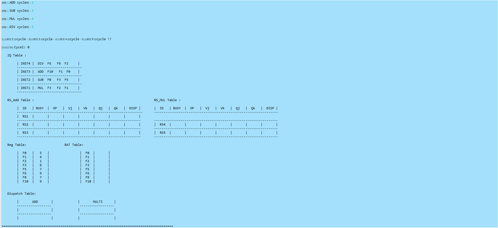
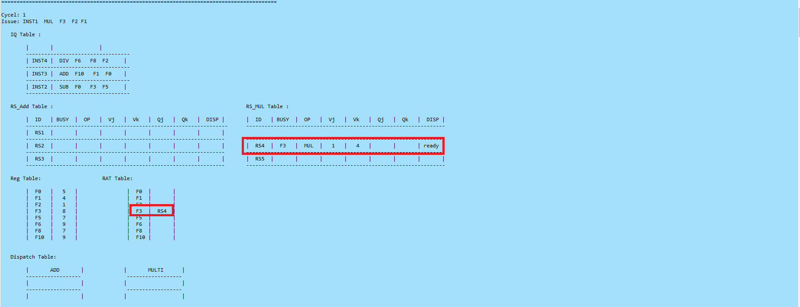

# Tomasulo-s-algorithm
## 1.本程式為實作Tomasulo-s-algorithm演算法
* 使用語言 Java(JRE JavaSE-12)
* 開發及編譯工具 Eclipse
* 輸入方式 
    1.允許使用者自行輸入ADD(加)、SUB(減)、MUL(乘)、DIV(除)運作之cycle數
    2.目前支援ADD、SUB、MUL、DIV等四項基礎運算，其他運算後續補充之
    3.允許使用者由原始碼端自行編輯Instruction數量及上述四項運算之運作
    4.完成上述初始狀態輸入後，由Eclipse IDE介面(或任何可執行Java語言之IDE)按下執行鍵，軟體即自行運作至所有Instruction取得暫存器之值後，自動停止
    5.本次執行案例系將ADD設為2cycle、SUB設為3cycle、MUL設為4cycle、DIV設為5cycle
    6.本軟體共模擬IQ Table儲存指令、RS_ADD_Table設置三個空間大小、RS_MUL設置二個空間大小、Reg Table儲存暫存器實際數值(系統預設值自動採1~10亂數產生相關資料)、RAT Table、加減法、乘除法 Buffer暫存器各一個，將在下節實際執行結果畫面呈現。
 
 ## 2.執行結果如下(以紅色方框標註各cycle變化)
    1.允許使用者自行輸入ADD(加)、SUB(減)、MUL(乘)、DIV(除)運作之cycle數

    2.使用者可由原始碼頁面輸入Instruction指令

    3.初始狀態預覽

    4.第1個cycle

    5.第2個cycle

    6.第3個cycle

    7.第4個cycle

    8.第5個cycle

    9.第6個cycle

    10.第7個cycle

    11.第8個cycle

    12.第9個cycle

    13.第10個cycle

    14.第11個cycle

   15.第12個cycle

   16.第13個cycle，以本範例，系統自動偵測無其他任何指令等待運算，自動結束運算

